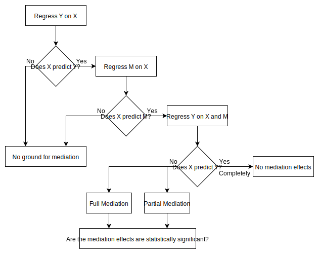

---
jupyter:
  jupytext:
    formats: ipynb,Rmd
    text_representation:
      extension: .Rmd
      format_name: rmarkdown
      format_version: '1.2'
      jupytext_version: 1.11.0
  kernelspec:
    display_name: R
    language: R
    name: ir
---

## **Mediation Analysis**
---


## Input


### Libraries

```{r}
# Library
spsm <- suppressPackageStartupMessages
spsm(library(dplyr))
spsm(library(tidyverse))
spsm(library(FactoMineR))
spsm(library(ggplot2))
spsm(library(factoextra))
spsm(library(corrplot))
spsm(library(mediation))
spsm(library(mosaic))
spsm(library(kableExtra))
spsm(library(IRdisplay))
spsm(library(vioplot))
```

### Ext. Functions

```{r}
# Function
source("../../utils/getData.R")
source("../../utils/getPCs.R")
source("../../utils/getPermut.R")
source("../../utils/getMediationTable.R")
source("../../utils/imputeBOCF.R")
source("../../utils/imputeLOCF.R")
```

### Load data at 4-month

```{r}
# example: dat <- getData("../../../data/", 1)
# options: 1: "SummaryMonths1to4.csv"
#          2: "SummaryMonths1to12.csv"
#          3: "SummaryMonths5to12Weight.csv
#          4: "SummaryMonths5to12All.csv"
pathFile <- c("../../../data/")
numFile <- 1
dat <- getData(pathFile, numFile)
```

```{r}
names(dat)
```

### Data description

<!-- #region -->
The data variables used in our mediation analysis are described as follows:   
* *Treatment* is the treatment assignment variable, where it equals 0 for self-paced subjects and 1 for counselor-initiated subjects.  

* *WeightLoss4Month* is a log-ratio indicating the rate of weight change at four months with respect to the baseline weight. If the value is positive, it indicates a weight loss; if it is negative, it corresponds to gain, and 0 indicates no change between 4 months and baseline.
* The potential mediators that we plan to analyze are the *self-weighing* variable and the principal components derived from the electronically collected variables' PCA. The logging variables quantify logging behavior in a number of days, and the caloric variables assess caloric intake and output. The logging and caloric variables are estimated over 4 months for the 4-month mediation analysis and 12 months for the 12-month mediation analysis. The average caloric variables quantify the sum of the calories divided by the total number of logged days. For example, *AverageDailyBreakfastCalories* equals the sum of intake calories reported at breakfast divided by the total number of days when breakfast was logged.

   
| Logging            | Caloric                       |
|--------------------|-------------------------------|
| LoggedWeekendDays  | AverageDailyIntakeCalories    | 
| LoggedWeekDays     | AverageDailyExerciseCalories  |
| TotalLoggedDays    | AverageDailyBreakfastCalories |
| TotalFoodDays      | AverageDailyLunchCalories     |
| TotalExerciseDays  | AverageDailyDinnerCalories    |
| TotalBreakfastDays | AverageDailySnackCalories     |
| TotalLunchDays     |                               |
| TotalDinnerDays    |                               |
| TotalSnackDays     |                               |


<!-- #endregion -->

---
## Principal Component Analysis

Applying a PCA (principal component analysis) reduces the number of variables and adresses the multicollinearity of the electronically collected variables.


### Variables selection

```{r}
# Select the variable indexes to include in the Principal Component Analysis
myCols <-c("LoggedWeekDays", "LoggedWeekendDays", "TotalLoggedDays","TotalFoodDays",
            "TotalExerciseDays", 
            "TotalBreakfastDays", "TotalLunchDays", "TotalDinnerDays", "TotalSnackDays",
            "AverageDailyIntakeCalories", "AverageDailyExerciseCalories", 
            "AverageDailyBreakfastCalories",
            "AverageDailyLunchCalories", "AverageDailyDinnerCalories","AverageDailySnackCalories")
# Get the indexes of those variables
idxApp <- match(myCols, colnames(dat))
```

### Apply the PCA

```{r}
# Get the results of PCA
resPC <- getPCs(dat, idxApp, numPCs = 3) # max numPCs is 5
# Get the data frame including the first three principal components named app1, app2, app3.
dat <- resPC$data
```

```{r}
# Display the variables name
# print(names(dat))
# Select variables of interest
if (numFile == 1){
  myCols <-c("id","WeightLoss4Month", "Treatment", "Age", "NumWeigh", "App1", "App2", "App3")  
} else {
  myCols <-c("id","WeightLoss12Month", "WeightLoss4Month", "Treatment", "Age", "NumWeigh", "App1", "App2", "App3")      
}

myIdx <- match(myCols, colnames(dat))
dat <- dat[, myIdx]
print(names(dat))
```

### Display PCA results

```{r}
# resPC contains also the scree plot{scree.plot}, cumulative variance explained {CV.plot}, 
# the variables contribution of each component {contribCorr.plot()} and the quality of those 
# contributions {cos2Corr.plot()}.
options(repr.plot.width = 10, repr.plot.height = 5)
resPC$CV.plot
```

```{r}
options(repr.plot.width = 10, repr.plot.height = 7)
resPC$contribCorr.plot(1.5) # to get numbers use resPC$contribCorrNum.plot()
```

```{r}
options(repr.plot.width = 10, repr.plot.height = 7)
resPC$cos2Corr.plot(1.5) # to get numbers use resPC$cos2CorrNum.plot()
```

---
## Analysis


The first step of the mediation analysis is to establish if our candidates variables are mediators or not.    
**To analyze the mediation we observe the following flowchart, where Y is the independent variable, X is the dependent variable, and M is the mediator:**



**We first estimated two linear regressions for both the mediator and the outcome. We used also a permutation test to assess any associations with respect to our samples.**


**Clean the data:** *impute with Baseline Observation Carried Forward algorithm*

```{r}
dat <-  dat <- imputeBOCF(dat, response = "4-month")
```

---
### Relationship association assessment

We will consider the following assumptions:

* App usage and Number of self-weiging are casually unrelated mediators.
* Observed confounder is : age. 


#### **Regression of weight loss on the treatment.**

```{r}
# Outcome model with confounders
out.fit <- lm(WeightLoss4Month ~ Treatment + Age, data = dat)
#  out.fit <- lm(WeightLoss12Month ~ Treatment + Age + Gender + logInitialWeight , data = dat)
summary(out.fit)
```

#### **Permutation test: Weight loss ~ treatment assignment**

```{r}
options(repr.plot.width = 10, repr.plot.height = 5)
getPermut(dat$WeightLoss4Month, dat$Treatment, P = 10000, IVname = "Weight Loss")
```

***We confirmed that the treatment has a statistically significant predictive capability on weight loss outcome.***


#### Regression of App-use (*i.e.*, PC1 ) on the treatment.

```{r}
# Outcome model with confounders
out.fit <- lm(App1 ~ Treatment + Age, data = dat)
summary(out.fit)
```

#### **Permutation test: App-use ~ treatment assignment**

```{r}
getPermut(dat$App1, dat$Treatment, P = 10000, IVname = "App-use")
```

#### Regression of App-calories (*i.e.*, PC2 ) on the treatment.

```{r}
# Outcome model with confounders
out.fit <- lm(App2 ~ Treatment + Age, data = dat)
summary(out.fit)
```

#### **Permutation test: App-calories ~ treatment assignment**

```{r}
getPermut(dat$App2, dat$Treatment, P = 10000, IVname = "App-calories")
```

#### **Regression of App-exercise (i.e., PC3 ) on the treatment.**

```{r}
# Outcome model with confounders
out.fit <- lm(App3 ~ Treatment + Age, data = dat)
summary(out.fit)
```

#### **Permutation test: App-exercise ~ treatment assignment**

```{r}
getPermut(dat$App3, dat$Treatment, P = 10000, IVname = "App-exercise")
```

#### **Regression of Self-weight on the treatment.**

```{r}
# Outcome model with confounders
out.fit <- lm(NumWeigh ~ Treatment + Age, data = dat)
summary(out.fit)
```

#### **Permutation test: Self-weight ~ treatment assignment**

```{r}
getPermut(dat$NumWeigh, dat$Treatment, P = 10000, IVname = "Self-weighing")
```

***We confirmed that the treatment has a statistically significant predictive capability on all potential mediators except for the app-exercise. Since app-use variable (i.e., PC1) explained more than 55% of the variance, we considered only app-use and self-weight variables for the mediation analysis for the 4 month-weight loss.***


---
## Mediation


**Our function `getMediationTable` to estimate the Average Causal Mediation Effect (ACME) and the Average Direct Effect (ADE) associated with each mediator is based on  the `mediation` library.**

```{r}
numFile <- 1
rslts <- getMediationTable(dat, numFile, myBoot = TRUE, numSims = 10000, confLvl = 0.90) 
```

### **Mediation Results** 
   

```{r}
rslts$med.tbl %>%
  kable("html") %>% 
  column_spec(c(1), bold = T, color = "black") %>%
  column_spec(c(2, 5, 8), bold = T, color = "steelblue") %>%
  column_spec(c(3, 4, 6, 7, 9, 10), bold = T, color = "sienna") %>%
  column_spec(c(11), bold = T, color = "black")%>%
  as.character() %>%
  display_html()
```

---
## Sensitivity Analysis

```{r}
# Sensitivity for the app-use
sensApp.out <- medsens(rslts$med.rslts$medApp.out, rho.by = 0.01, effect.type = "indirect", sims = 10000)
# Sensitivity for the app-calories
sensCal.out <- medsens(rslts$med.rslts$medCal.out, rho.by = 0.01, effect.type = "indirect", sims = 10000)
# Sensitivity for the self-weight
sensNumW.out <- medsens(rslts$med.rslts$medNumW.out, rho.by = 0.01, effect.type = "indirect", sims = 10000)
```

### App-use


#### Results

```{r}
summary(sensApp.out)
```

#### Sensitivity with respect to error correlation

```{r}
options(repr.plot.width = 10, repr.plot.height = 7)
plot(sensApp.out,  ylim = c(-0.18, 0.18), main  =  expression(paste("App-use ACME(", rho, ")")))
```

The above figure shows the estimated true values of ACMEs as a function of the sensitivity parameter $\rho$. The parameter $\rho$
expresses the correlation between the error terms in the mediator and the outcome models. The solid thick line and its shaded area represent the ACME's point estimates and their 90% confidence intervals, respectively.    
According to this analysis, the ACME is estimated to be negative when  $\rho$ is larger than 0.36, and the ACME is statistically indistinguishable from zero at the 90% level when the parameter $\rho$ is larger than 0.26 and less than 0.44.


#### Sensitivity with respect to proportion of variance explained

```{r}
plot(sensApp.out, sens.par = "R2", r.type = "total", sign.prod = "positive",
     xlim = c(-0.0, 0.6), ylim = c(-0.0, 0.7))
```

In the sensitivity analyses plot above, the ACME estimates are plotted as contour lines against $\tilde{R}^2_Y \tilde{R}^2_M$, the proportions of the total variance in the outcome and mediator variables, respectively, that would be explained by a hypothetical unobserved pretreatment confounder.
The bold line represents the various product combinations in terms of the coefficient of determination where the ACME would become 0. In this case, the estimated ACME will be 0 if the product of $\tilde{R}^2_M$ and $\tilde{R}^2_Y$ is 0.0575. For example, this implies that an unobserved pretreatment confounder would explain 20% of the variation in the participants’ app-use and 28.7% of the variation in their weight loss.


### App-calories


#### Results

```{r}
summary(sensCal.out)
```

#### Sensitivity with respect to error correlation

```{r}
options(repr.plot.width = 10, repr.plot.height = 7)
plot(sensCal.out,  ylim = c(-0.18, 0.18), main  =  expression(paste("App-calories ACME(", rho, ")")))
```

The above figure shows the estimated true values of ACMEs as a function of the sensitivity parameter $\rho$. The parameter $\rho$
expresses the correlation between the error terms in the mediator and the outcome models. The solid thick line and its shaded area represent the ACME's point estimates and their 90% confidence intervals, respectively.    
According to this analysis, the ACME is estimated to be negative when  $\rho$ is larger than -0.17, and the ACME is statistically indistinguishable from zero at the 90% level when the parameter $\rho$ is larger than -0.38 and less than 0.08.


#### Sensitivity with respect to proportion of variance explained

```{r}
plot(sensCal.out, sens.par = "R2", r.type = "total", sign.prod = "positive",
     xlim = c(-0.0, 0.95), ylim = c(-0.0, 0.7))
```

In the sensitivity analyses plot above, the ACME estimates are plotted as contour lines against $\tilde{R}^2_Y \tilde{R}^2_M$, the proportions of the total variance in the outcome and mediator variables, respectively, that would be explained by a hypothetical unobserved pretreatment confounder.
The bold line represents the various product combinations in terms of the coefficient of determination where the ACME would become 0. In this case, the estimated ACME will be 0 if the product of $\tilde{R}^2_M$ and $\tilde{R}^2_Y$ is 0.0225. For example, this implies that an unobserved pretreatment confounder would explain 20% of the variation in the participants’ app-calories and 11.25% of the variation in their weight loss.


### Self-weight


#### Results

```{r}
summary(sensNumW.out)
```

#### Sensitivity with respect to error correlation

```{r}
plot(sensNumW.out,  ylim = c(-0.18, 0.18), main  =  expression(paste("Self-weight ACME(", rho, ")")))
```

The above figure shows the estimated true values of ACMEs as a function of the sensitivity parameter $\rho$. The parameter $\rho$
expresses the correlation between the error terms in the mediator and the outcome models. The solid thick line and its shaded area represent the ACME's point estimates and their 90% confidence intervals, respectively.    
According to this analysis, the ACME is estimated to be negative when  $\rho$ is larger than 0.39, and the ACME is statistically indistinguishable from zero at the 90% level when the parameter $\rho$ is larger than 0.30 and les than 0.48.


#### Sensitivity with respect to proportion of variance explained

```{r}
plot(sensNumW.out, sens.par = "R2", r.type = "total", sign.prod = "positive",
     xlim = c(-0.0, 0.72), ylim = c(-0.0, 0.7))
```

In the sensitivity analyses plot above, the ACME estimates are plotted against $\tilde{R}^2_Y \tilde{R}^2_M$, the proportions of the total variance in the outcome and mediator variables, respectively, that would be explained by a hypothetical unobserved pretreatment confounder.
The bold line represents the various product combinations in terms of the coefficient of determination where the ACME would become 0. In this case, the estimated ACME will be 0 if the product of $\tilde{R}^2_M$ and $\tilde{R}^2_Y$ is 0.0786. For example, this implies that an unobserved pretreatment confounder would explain 20% of the variation in the participants’ app-calories and 39.3% of the variation in their weight loss.


## Conclusion


Overall, the results suggest that under the assumption of independence between mechanisms, the causal mediation effects are positive and
moderately statistically significant in all of the three studies, and the estimates are fairly robust to the
possible unobserved pretreatment mediator–outcome confounding to varying degrees for the app-use and self-weighing. However, it appears that the mediation of the app-calories is much less robust to the possible unobserved pretreatment mediator–outcome confounding. 

```{r}
sessionInfo()
```
